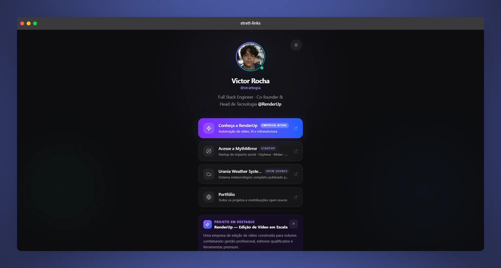

<p align="center">
  <a href="https://nextjs.org/"></a>
  <a href="https://www.typescriptlang.org/"></a>
  <a href="https://tailwindcss.com/"></a>
  <a href="https://www.framer.com/motion/"></a>
  <a href="https://analytics.google.com/"></a>
  <a href="https://lucide.dev/"></a>
  <a href="https://react-icons.github.io/react-icons/"></a>
  <a href="https://vercel.com/"></a>
</p>

# 🌟 stratt-links — Premium Micro Landing Page



> Um agregador de links de altíssima fidelidade visual, portfólio minimalista e conversão estratégica de clientes. Projetado com foco obsessivo em UX, performance e fidelidade visual.


***

## ✨ Diferenciais do Projeto

- **🎨 Design System Centralizado:** Chega de classes utilitárias poluindo o JSX com `dark:`. Toda a dinâmica de cores escuras e claras foi centralizada em variáveis semânticas dentro do `globals.css` utilizando o motor do **Tailwind CSS v4**.
- **👁️ Acessibilidade e Contraste:** Cores calibradas cirurgicamente para que textos descritivos e badges não fiquem opacos ou camuflados quando o tema claro estiver ativo.
- **✨ Animações Orgânicas (UX-First):** Efeito de *tilt 3D* e transições baseadas em física de molas (*springs*) no Framer Motion. Interações sutis que elevam a percepção de valor do portfólio sem cansar o usuário.
- **🟢 WhatsApp Premium CTA:** Botão de conversão nativo para fechar novos projetos, equipado com um indicador dinâmico de status *Online* (efeito de radar/pulsar duplo).
- **🤖 SEO Avançado Integrado:** Geração dinâmica automatizada para `sitemap.xml` e `robots.txt` direto pela camada de rotas do Next.js.

***

## 🛠️ Stack Tecnológica

| Tecnologia | Versão | Propósito no Projeto |
| :--- | :---: | :--- |
| **Next.js** | 15 | Framework Base com App Router & Metadata API |
| **Tailwind CSS** | v4 | Estilização veloz baseada em tokens `@theme` |
| **Framer Motion** | 11 | Animações fluidas, efeitos de mola e Micro-interações |
| **next-themes** | 0.4 | Gerenciamento de tema (Dark/Light) sem *FOUC* |
| **Lucide React + React Icons** | 0.469 | Pacote de ícones minimalistas e consistentes |

***

## 🚀 Setup Local

Siga os passos abaixo para rodar o projeto em sua máquina:

```bash
# 1. Clone o repositório
git clone https://github.com/strattegia-mp3/stratt-links.git

# 2. Acesse a pasta do projeto
cd stratt-links

# 3. Instale as dependências
npm install

# 4. Configure as variáveis de ambiente
cp .env.example .env.local

# 5. Inicialize o servidor de desenvolvimento
npm run dev
```

Acesse [http://localhost:3000](https://www.google.com/search?q=http://localhost:3000) no seu navegador.

## ✏️ Personalização em 2 Minutos

O projeto foi estruturado para ser uma arquitetura desacoplada de dados. Você não precisa mexer em arquivos de estilização ou componentes visuais para mudar o conteúdo.

Abra o arquivo central de dados:

```bash
src/data/linksData.ts
```

Modifique as constantes estruturadas em TypeScript para atualizar instantaneamente o site:

- `profile`: Seu nome, foto de perfil, bio e profissão.
- `mainLinks`: Seus links principais (com suporte a variantes `primary`, `secondary` e `accent`).
- `featuredProject`: O card em destaque com título, descrição e tags de tecnologias.
- `socialLinks`: Os pequenos ícones circulares do rodapé.
- `whatsappCTA`: A mensagem e o link direcionados para o seu fechamento de vendas.

## 📁 Estrutura de Arquivos Organizada

```plaintext
src/
├── app/
│   ├── globals.css         # 📌 Design System centralizado (Tailwind v4)
│   ├── layout.tsx          # Configurações de Viewport, Fontes e Analytics
│   ├── page.tsx            # Árvore limpa de renderização da página
│   ├── robots.ts           # 🤖 Gerador programático do robots.txt
│   └── sitemap.ts          # 🗺️ Gerador dinâmico do sitemap.xml
├── components/
│   ├── ThemeProvider.tsx   # Provedor do ciclo de vida dos temas
│   ├── ThemeToggle.tsx     # Botão animado de alternância de cores
│   ├── Profile.tsx         # Cabeçalho com o seu perfil
│   ├── LinkButton.tsx      # Cards de links otimizados em 3D e Z-Index estável
│   ├── LinksList.tsx       # Mapeamento e renderização dos botões
│   ├── FeaturedProject.tsx # Card de projeto em destaque
│   ├── WhatsAppCTA.tsx     # Botão de conversão com animação de pulso
│   └── Footer.tsx          # Ícones sociais e Copyright semântico
└── data/
    └── linksData.ts        # ⭐ ARQUIVO CENTRAL DE CONFIGURAÇÃO DE DADOS
```

## 🌐 Deploy na Vercel (Otimizado)

O projeto está configurado para herdar as melhores otimizações de entrega estática do Next.js.

### Configuração das Variáveis de Ambiente no Painel

Ao importar o repositório na Vercel, adicione as seguintes chaves de ambiente em `Settings → Environment Variables`:

| Chave | Exemplo de Valor | Descrição |
| :--- | :--- | :--- |
| `NEXT_PUBLIC_GA_ID` | `G-XXXXXXXXXX` | ID de acompanhamento do Google Analytics 4 |
| `NEXT_PUBLIC_BASE_URL` | `https://seudominio.com` | URL final de produção (usada no SEO/Sitemap) |

## ⚙️ Progressive Web App (PWA) & Mobile Ready

O repositório já inclui um arquivo `manifest.webmanifest` pré-configurado com a cor de inicialização em `#fafafa`. Isso garante que se o usuário optar por "Adicionar à Tela Inicial" no celular, o site se comportará como um aplicativo nativo, com uma tela de carregamento suave, sem flashes brancos irritantes na transição visual de carregamento.

---

## ⚖️ Licença e Termos de Uso

Este software é um **código autoral protegido**. É concedida permissão gratuita para qualquer pessoa clonar, modificar e utilizar os arquivos exclusivamente para fins de estudo pessoal, aprendizado e fins acadêmicos.

### ⚠️ Restrições de Uso

- A comercialização, venda, licenciamento ou sublicenciamento deste código-fonte são **expressamente proibidas**.
- A venda ou desenvolvimento de sites comerciais para clientes terceiros utilizando este template como base estrutural também estão expressamente proibidas.

Para detalhes completos dos termos jurídicos e limitações, por favor, leia o arquivo [`LICENSE`](./LICENSE) na raiz deste repositório.

<div align="right">
  <p><code>~ $ "Desenvolvido com 💜 e TypeScript por Victor Rocha."</code></p>
</div>